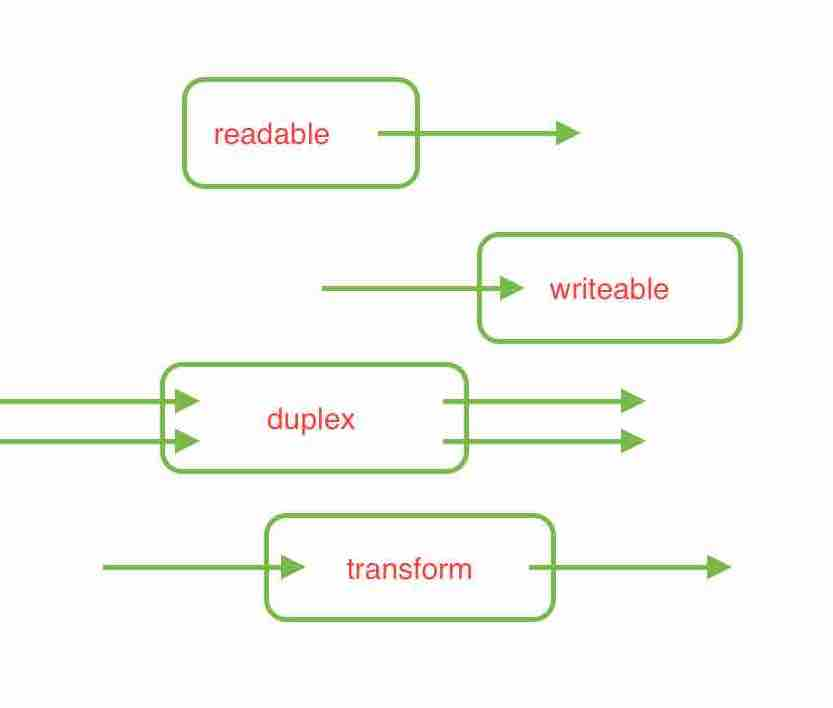

### stream (数据块) 管道，水流

> EventEmitter => Stream =>

> 读文件: createReadStream

> 写文件: createWriteStream

> 可读流: 数据源，存在buffer缓冲区

> 可写流: 数据终点

> 双工: duplex

> 转换: transform

> readable.pipe(writable, [options])



- 管道
```
cat gzipSend.js | node readStdin.js
```

### execute script
```
cat gzipSend.js | node readStdin.js
node randomGenerate.js
node stream_vs_buffer.js
node gzipReceive.js - node gzipSend.js
node entropyServer.js - curl localhost:3000
node writeToFile.js
node replaceStreamTest.js
echo Hello World! | node replace.js World Node.js
```

- inspired by [juejin article](https://juejin.im/post/5a4a377151882546f00a68c9)